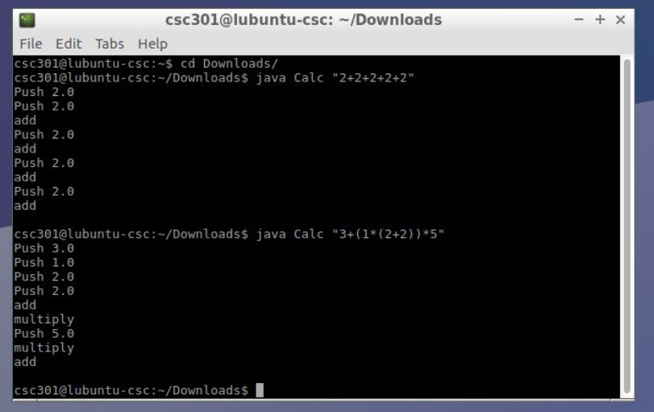

# Calculator-Stack-Machine-Commander

Dependencies/Installation:

	Install the Java jdk of your choice (OpenJDK installation shown)

	sudo apt-get install openjdk-8-jdk
	
Compiling and Running Code:

	Compile:
	
	javac Calc.java
	
	javac CalcParser.java
	
	javac CalcLexer.java
	
	
	Run:
	
	java Calc "<expression>"
	
	e.g.
	
	java Calc "3+3+2*2+3*(1+3)"
	
